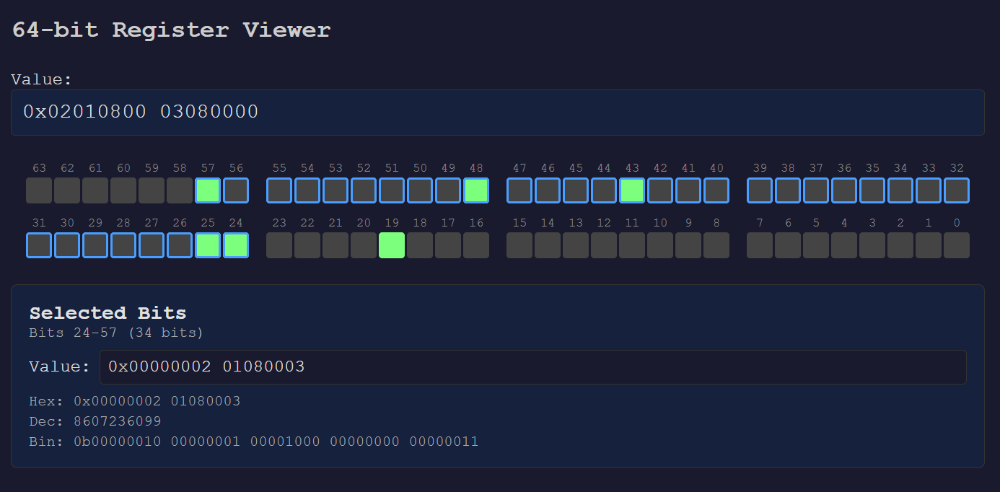

# 64-bit Register Viewer

A web-based tool for visualizing and editing 64-bit registers. Enter a value in hex (`0x...`), binary (`0b...`), or decimal, and interact with individual bits through the visual grid.

Visit https://feather179.github.io/RegisterViewer/ to try online.



## Features

- **64-bit grid display** — bits arranged in 2 rows × 4 byte-groups, with index labels
- **Multi-format input** — hex, binary, or decimal; auto-formatted with 32-bit grouping on output
- **Bit selection** — click to select, drag or Shift+click to range-select, Ctrl+click to toggle bit value
- **Double-click toggle** — double-click a bit to flip its value
- **Sub-value panel** — view/edit the value of the selected bit range; shows hex, decimal, and binary representations

## Usage

Open `index.html` in any modern browser.

| Action | Result |
|---|---|
| Click a bit | Select it |
| Drag across bits | Select range |
| Shift+click | Range-select from anchor |
| Ctrl+click / ⌘+click | Toggle bit value |
| Double-click a bit | Toggle bit value |
| Edit input field | Update register value |
| Edit sub-value field | Write to selected bits |

## Project Structure

```
index.html   — HTML layout
style.css    — Dark-theme styles
app.js       — RegisterViewer class (all logic)
```

No build step or dependencies required.
